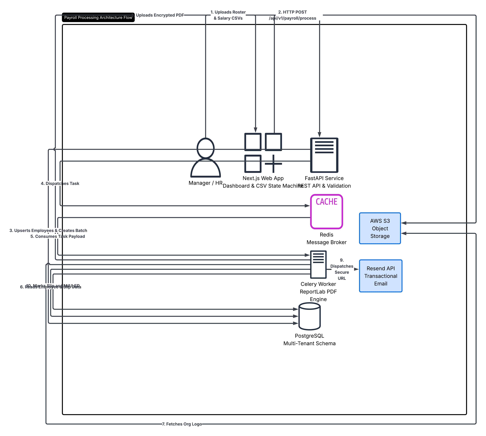
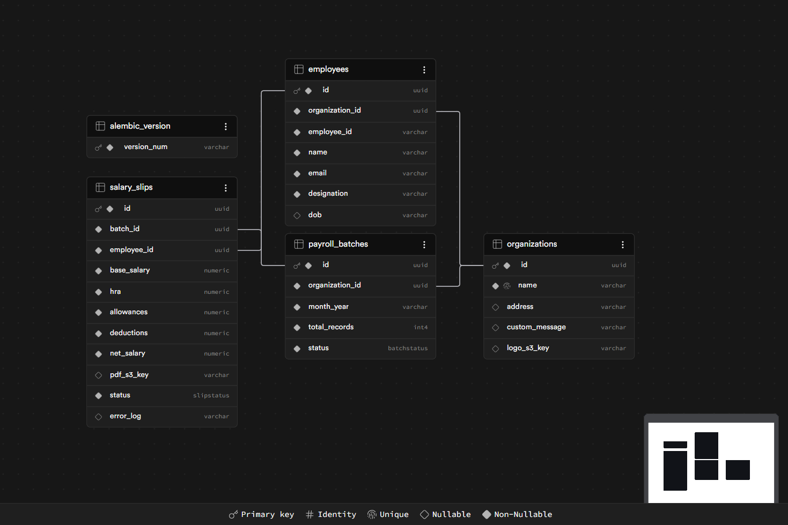
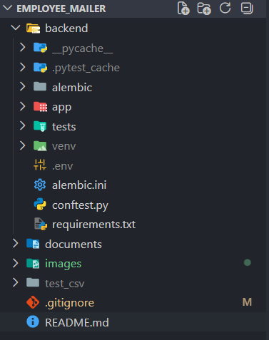

# 🚀 Automated Enterprise Payroll Pipeline (AEPP)

Enterprise-grade asynchronous payroll automation platform for generating, securing, storing, and distributing salary slips at scale.

---

# What AEPP Actually Does

AEPP automates the complete payroll distribution workflow.

Organizations upload employee data and monthly payroll information, and the system automatically:

- Parses uploaded payroll CSV files
- Validates employee and salary records
- Generates encrypted salary slip PDFs
- Stores generated artifacts securely
- Delivers salary slips directly to employees
- Processes payroll batches asynchronously

The goal is simple:

> Convert payroll processing from a repetitive manual workflow into an automated background pipeline.

---

# How AEPP Works

AEPP follows a decoupled event-driven architecture.

Frontend responsibilities:

- Upload handling
- CSV validation
- User interactions
- Review interfaces

Backend responsibilities:

- Persistent storage
- Background processing
- PDF generation
- Storage handling
- Email delivery

Heavy operations intentionally happen outside the request lifecycle.

This prevents:

- Browser timeouts
- Blocking operations
- Large batch failures

---

# High Level Explanation

The platform is built around two architectural principles.

## Multi Tenant Isolation

Each organization operates within its own isolated workspace.

This prevents:

- Cross organization collisions
- Shared employee records
- Payroll leakage

---

## Background Processing

Payroll generation is computationally expensive.

Instead of forcing users to wait:

- API stores data
- Background workers process requests
- Users continue immediately

---

# System Architecture

The system separates ingestion, processing, storage, and delivery into independent services.


---

## Processing Pipeline



---

# Initial Design Evolution

The project began with architecture exploration and processing sketches before implementation.

## Initial Architecture Sketch


---

## Initial Interface Prototype


These iterations were used to validate:

- Upload flow
- Worker separation
- Processing order
- Data movement paths

---

# Data Flow

### Step 1 — Upload

User uploads:

- Employee roster
- Salary sheet

Frontend:

- Removes BOM characters
- Validates headers
- Normalizes data

↓

### Step 2 — Backend Validation

FastAPI:

- Receives upload
- Creates employee records
- Creates batch records

↓

### Step 3 — Queue Creation

FastAPI:

- Stores pending slips
- Pushes tasks into Redis

↓

### Step 4 — Worker Processing

Celery:

- Pulls tasks
- Generates salary slips
- Encrypts PDFs

↓

### Step 5 — Storage

Generated PDFs:

- Uploaded to S3
- Stored privately

↓

### Step 6 — Delivery

System:

- Creates presigned URLs
- Sends employee emails

---

# How To Use

## Step 1 — Open Platform

Access frontend.

Create workspace.

or

Login into existing workspace.

---

## Step 2 — Upload Employee Roster

Upload:

```text
roster.csv
```

Contains:

- Employee ID
- Name
- Email
- Designation
- DOB

---

## Step 3 — Upload Salary Sheet

Upload:

```text
salary.csv
```

Contains:

- Base Salary
- HRA
- Allowances
- Deductions

---

## Step 4 — Review Upload

Review parsed data.

Confirm processing.

---

## Step 5 — Employee Receives Email

Employee downloads encrypted PDF.

Password format:

```text
DOB + EmployeeID
```

Example:

```text
22012005EMP001
```

---

# Clone & Run

## Requirements

- NodeJS v18+
- Python 3.10+
- Redis
- PostgreSQL

---

## Clone

```bash
git clone https://github.com/your-username/aepp.git

cd aepp
```

---

## Frontend

```bash
cd frontend

npm install

npm run dev
```

Create:

```env
NEXT_PUBLIC_API_URL=http://localhost:8000
```

---

## Backend

```bash
cd backend

python -m venv venv

source venv/bin/activate

pip install -r requirements.txt
```

---

## Run Services

Database:

```bash
alembic upgrade head
```

API:

```bash
uvicorn app.main:app --reload
```

Worker:

```bash
celery -A app.celery_app worker --loglevel=info
```

---

# Database Structure

Database is normalized into independent entities.

## Current Database Structure



---

## Tables

### employees

Stores:

- Employee identity
- Contact information

---

### payroll_batches

Stores:

- Upload batches
- Batch status

---

### salary_slips

Stores:

- Salary records
- Processing state
- PDF references

---

# Configuration

## PDF Configuration

Uses:

### ReportLab

Reason:

- Dynamic rendering
- Flow based layouts

Encryption:

- StandardEncryption

Permissions:

- Copy disabled
- Modification disabled

---

## Celery Configuration

Purpose:

Move expensive operations outside APIs.

Configuration:

```text
Concurrency = 1
```

Prevents:

- Memory spikes
- Worker crashes

---

## Redis Configuration

Used for:

- Task queues
- Worker communication

---

## Database Configuration

PostgreSQL + Supabase

Provides:

- Transactions
- Constraints
- Relational storage

---

# Services Used

## NextJS

Used For:

- Frontend
- Dashboard
- Upload interface

Why:

- Rich UI ecosystem
- Fast iteration

---

## FastAPI

Used For:

- APIs
- Validation
- Processing

Why:

- Async architecture
- High throughput

---

## Celery + Redis

Used For:

- Background execution

Why:

- Prevent blocking requests

---

## PostgreSQL / Supabase

Used For:

- Relational storage

Why:

- Multi tenant architecture

---

## AWS S3

Used For:

- Salary slip storage

Why:

- Secure object storage

---

## Resend

Used For:

- Transactional email delivery

Why:

- Reliable delivery pipeline

---

# Project Contents

Frontend:

- Upload interfaces
- Validation
- Dashboard

Backend:

- APIs
- Workers
- Database
- PDF generation

---

# Project Structure Visualization



---

# Folder Structure

```text
AEPP/

├── backend/
│   ├── alembic/
│   ├── app/
│   ├── tests/
│   ├── .env
│   ├── requirements.txt
│   └── alembic.ini
│
├── documents/
├── images/
├── test_csv/
├── README.md
└── .gitignore
```

---

# User Flow & Workspace Operations

## 🏢 1. Workspace Authentication

### Create Workspace

User:

- Fills company details
- Uploads logo
- Clicks:

```text
Create Workspace & Continue
```

Backend:

- Creates UUID
- Uploads logo
- Stores workspace

Possible Errors:

```text
Workspace already exists
```

---

### Existing Workspace Login

User:

```text
Already have workspace?
```

Backend:

- Looks up organization
- Returns workspace

Possible Errors:

```text
Workspace not found
```

---

## 📋 2. Employee Roster Upload

User actions:

- Upload CSV
- Download sample
- Add rows manually
- Remove rows
- Skip roster upload

Progression:

```text
Save roster & continue
```

Possible Errors:

```text
Missing headers

Employee conflicts
```

---

## 💰 3. Salary Upload

Actions:

- Upload salary CSV
- Edit records
- Return to roster

Progression:

```text
Preview payment CSV
```

Possible Errors:

```text
Employee ID not found
```

---

## 🔍 4. Preview & Dispatch

User:

- Reviews merged table
- Confirms processing

System:

- Creates batch
- Sends tasks to queue
- Shows success state

---

## 🔒 5. Employee Flow

Employee:

Receives:

- Email
- Secure link
- Encrypted PDF

Password Rules:

- Remove special characters from DOB
- Uppercase Employee ID
- Combine both

Examples:

```text
22-01-2005 + EMP001

↓

22012005EMP001
```

```text
1990/04/12 + emp-002

↓

19900412EMP002
```

---

# Testing & Validation Phase

Testing was performed incrementally to validate subsystems before full integration.

---

# Software Used During Testing

Backend:

- Pytest
- Uvicorn
- FastAPI Swagger

Frontend:

- NextJS Dev Server

Database:

- Supabase Dashboard

Pipeline:

- Real Email Delivery
- PDF Verification

---

# Frontend Validation


Validated:

- CSV parsing
- Table rendering
- Preview generation

---

# API Validation


Validated:

- Multipart uploads
- Batch creation
- HTTP responses

---

# Automated Backend Testing


Tests:

- Valid uploads
- Invalid file rejection

Example:

```bash
pytest -v
```

Result:

```text
2 tests passed
```

---

# Database Verification


Validated:

- Employee insertion
- Batch generation
- Salary creation

---

# PDF Validation


Validated:

- Salary calculations
- Layout correctness
- Encryption

---

# Email Delivery Validation


Validated:

- Delivery pipeline
- URL generation
- Email formatting

---

# End To End Validation

```text
CSV Upload

↓

Database Write

↓

Queue Creation

↓

Worker Processing

↓

PDF Generation

↓

S3 Upload

↓

Email Delivery
```

Verified:

- Pipeline reliability
- Worker execution
- Data integrity
- Artifact generation
- Asynchronous execution
