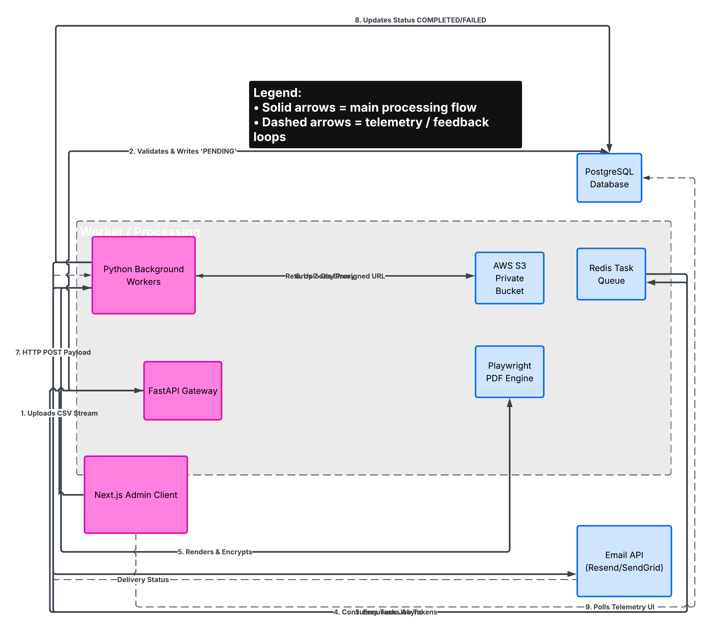
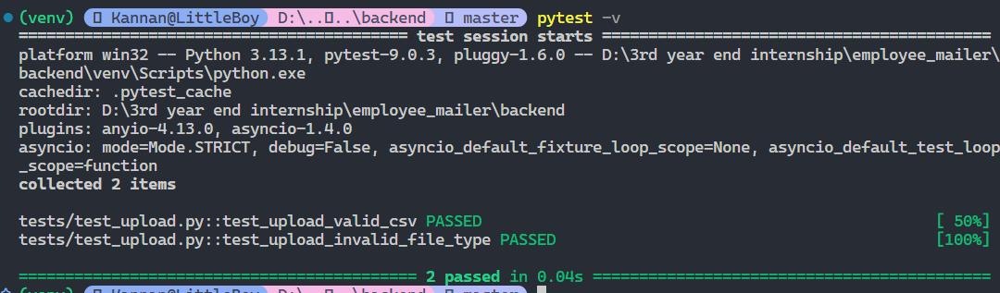
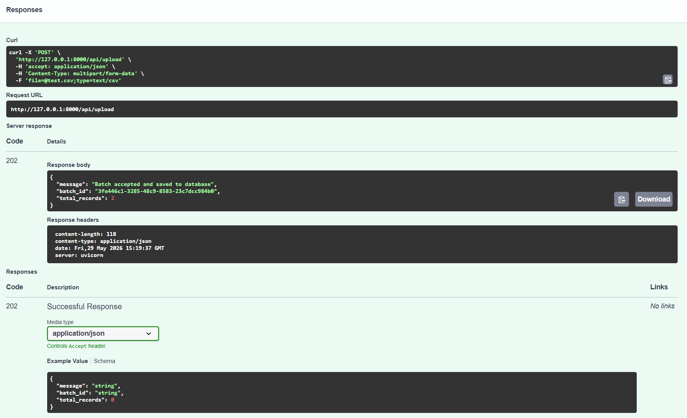
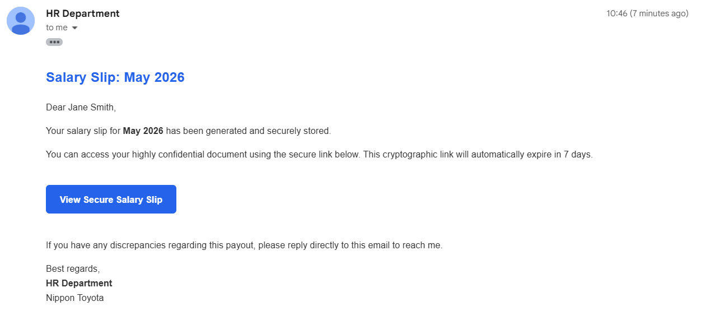
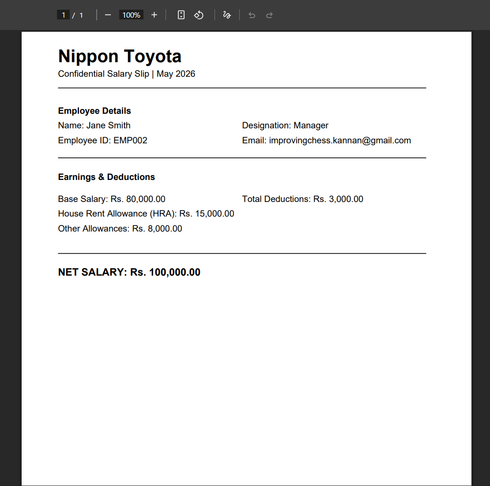

# Asynchronous Enterprise Payroll Pipeline (AEPP)

AEPP is an asynchronous payroll processing system designed to handle bulk employee payroll uploads, generate salary slips, securely store generated artifacts, and dispatch them without blocking API requests.

The system uses queue-based processing to move computationally expensive operations such as PDF generation and email delivery outside the request lifecycle.

---

# System Architecture & Design



The system is designed around asynchronous execution and fault isolation.

### Processing Flow

```text
CSV Upload
    ↓
FastAPI Upload Gateway
    ↓
Validation + Database Insert
    ↓
Redis Queue
    ↓
Background Workers
    ↓
PDF Generation
    ↓
Secure Storage
    ↓
Email Delivery
```

### Architecture Principles

* API requests should never generate PDFs
* Background workers should operate independently from API availability
* Files should not persist on local storage
* Processing status should be observable through database state

---

# Initial Architecture Design



The original design focused on:

1. Worker decoupling
2. Queue based processing
3. Stateless document generation
4. Processing telemetry
5. Cloud storage integration

---

# Technology Stack

## Backend

* FastAPI
* PostgreSQL
* SQLAlchemy (Async)
* Alembic
* Celery

## Infrastructure

* Redis (Upstash)
* AWS S3
* Resend API

## Document Generation

* ReportLab
* In-memory buffer streaming

## Frontend (WIP)

* Next.js
* Tailwind CSS

---

# Database Design

The system revolves around three primary entities.

## employees

Stores employee metadata.

* Employee ID
* Name
* Email
* Designation

## payroll_batches

Tracks upload lifecycle.

* Batch ID
* Status
* Total records
* Processing metadata

## salary_slips

Stores generated payroll data.

* Salary components
* Storage references
* Processing status
* Error tracking

---

# Engineering Milestones & Implementation Proofs

---

## Phase 1 — Async API & Validation Layer

Upload endpoints were implemented using asynchronous database sessions and strict validation rules.

### Implemented

* CSV validation
* MIME validation
* Batch creation logic
* Async testing

### Test Execution



Run:

```bash
cd backend

pytest -v
```

Example:

```text
2 passed in 0.04s
```

The test suite validates:

* Accepted CSV uploads
* Invalid file rejection
* Database interactions
* Async endpoint behavior

---

## Phase 2 — Decoupled Upload Gateway

The upload gateway validates payroll batches and immediately returns control to the client.

### Upload Success Proof



Example response:

```json
{
    "message":"Batch accepted and saved to database",
    "batch_id":"uuid",
    "total_records":2
}
```

Response:

```text
HTTP 202 Accepted
```

This confirms:

* Validation succeeded
* Database insertion succeeded
* Batch creation succeeded
* Processing moved into background systems

---

## Phase 3 — Payload Engine & Email Delivery

Background workers fetch payroll records, generate salary slips, store artifacts, and dispatch emails.

### Transactional Email Delivery



Implemented:

* Dynamic email templates
* Verified sender domains
* Queue-based delivery
* Rate-limited dispatching

This demonstrates:

* Worker-to-email integration
* Dynamic payload rendering
* Successful transactional delivery

---

### Secure PDF Access



Implemented:

* In-memory PDF generation
* AWS S3 uploads
* Temporary signed URLs
* Private artifact storage

This demonstrates:

* Generated PDFs are not attached directly
* Documents are stored privately
* Access can expire automatically

---

# Project Structure

```text
EMPLOYEE_MAILER/

├── backend/
│   ├── alembic/
│   ├── app/
│   ├── tests/
│   ├── .env
│   ├── alembic.ini
│   ├── conftest.py
│   └── requirements.txt
│
├── documents/
│
├── images/
│
├── test_csv/
│
├── .gitignore
│
└── README.md
```

---

# Getting Started

## Prerequisites

* Python 3.10+
* PostgreSQL
* Redis
* AWS Account
* Resend API Key

---

## Backend Setup

Clone:

```bash
git clone <repository-url>

cd EMPLOYEE_MAILER/backend
```

Create environment:

```bash
python -m venv venv
```

Windows:

```bash
venv\Scripts\activate
```

Linux / Mac:

```bash
source venv/bin/activate
```

Install:

```bash
pip install -r requirements.txt
```

---

## Configure Environment Variables

Create:

```text
backend/.env
```

Example:

```env
DATABASE_URL=

REDIS_URL=

AWS_ACCESS_KEY_ID=

AWS_SECRET_ACCESS_KEY=

AWS_REGION=

S3_BUCKET_NAME=

EMAIL_API_KEY=

VERIFIED_DOMAIN=
```

---

## Run Database Migrations

```bash
alembic upgrade head
```

---

## Start FastAPI

```bash
uvicorn app.main:app --reload
```

---

## Start Workers

```bash
celery -A app.celery_app worker --loglevel=info --pool=solo
```

---

## Run Tests

```bash
pytest -v
```

---

# Future Improvements

* Dead Letter Queue support
* Worker autoscaling
* Batch telemetry dashboard
* Real-time progress tracking
* Multi-tenant payroll support

---

Developed by **Gowrishankar S Menon**
