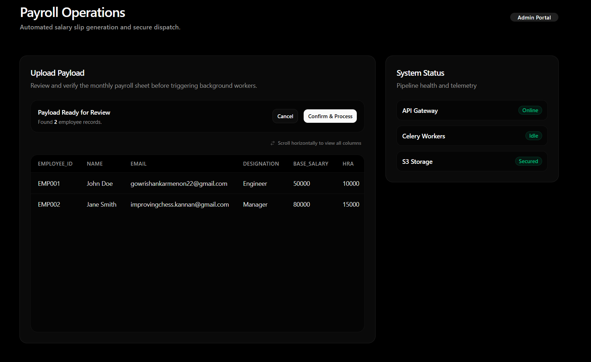
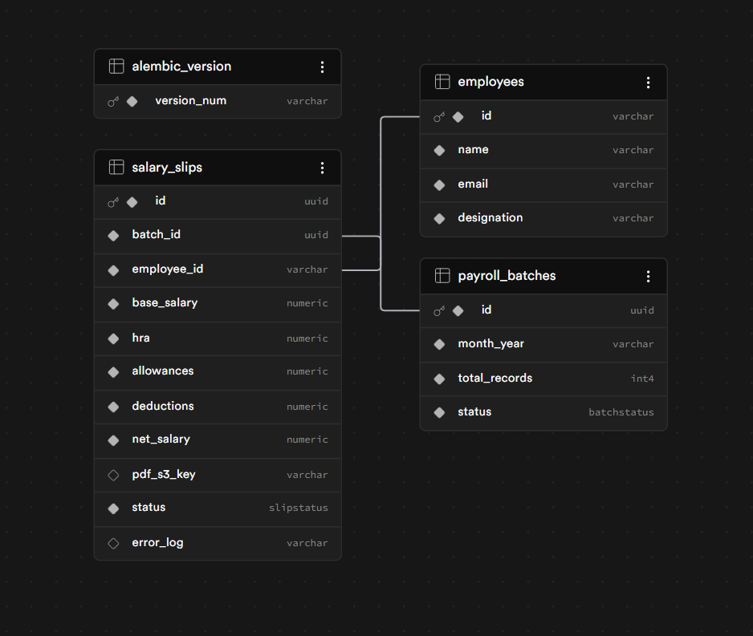

# Asynchronous Enterprise Payroll Pipeline (AEPP)

AEPP is an asynchronous payroll processing system designed to handle bulk employee payroll uploads, generate salary slips, securely store generated artifacts, and dispatch them without blocking API requests.

The system uses queue-based processing to move computationally expensive operations such as PDF generation and email delivery outside the request lifecycle.

---

# System Architecture & Design


The system is designed around asynchronous execution and fault isolation.

### Processing Flow

```text
CSV Upload
    ↓
FastAPI Upload Gateway
    ↓
Validation + Database Insert
    ↓
Redis Queue
    ↓
Background Workers
    ↓
PDF Generation
    ↓
Secure Storage
    ↓
Email Delivery
```

### Architecture Principles

* API requests should never generate PDFs
* Background workers operate independently from API availability
* Files do not persist on local storage
* Processing status remains observable through database state

---

# Initial Architecture Design


The original design focused on:

1. Worker decoupling
2. Queue based processing
3. Stateless document generation
4. Processing telemetry
5. Cloud storage integration

---

# Frontend Specifications & Architecture

The frontend is designed as a decoupled client application that communicates independently with backend services.



The dashboard provides administrators with payroll upload, validation, preview, and processing capabilities.

## Tech Stack

### Framework

* Next.js (App Router)

### Styling

* Tailwind CSS v4

### Components

* shadcn/ui
* Radix UI primitives

### Client Side Processing

* PapaParse

### Icons

* Lucide React
* Custom SVGs

---

## Core UI Components

### CsvUploader (`components/csv-uploader.tsx`)

Handles three primary states:

### Idle State

Displays drag-and-drop upload interface.

### Preview State

* Parses CSV locally
* Displays horizontally scrollable preview table
* Allows administrator verification before submission

### Processing State

* Handles loading states
* Sends files to backend APIs
* Displays system telemetry

---

# Frontend Backend Integration

The frontend and backend communicate through REST APIs while remaining completely decoupled.

## Communication Flow

### 1. Client Side Validation

CSV files are parsed locally.

No backend communication occurs during preview.

---

### 2. Data Dispatch

The raw file is packaged into a FormData object.

---

### 3. Transmission

The frontend performs a POST request to FastAPI.

---

### 4. Asynchronous Processing

FastAPI:

* Validates payload
* Writes metadata to PostgreSQL
* Pushes batch into Redis
* Returns HTTP 202 immediately

---

## API Specification

### Endpoint

```text
POST /api/v1/payroll/upload
```

### Content Type

```text
multipart/form-data
```

### Frontend Request Example

```javascript
const formData = new FormData();

formData.append("file", rawFile);

const response = await fetch(
  "http://localhost:8000/api/v1/payroll/upload",
  {
      method: "POST",
      body: formData,
  }
);
```

---

# Technology Stack

## Backend

* FastAPI
* PostgreSQL
* SQLAlchemy (Async)
* Alembic
* Celery

## Infrastructure

* Redis (Upstash)
* AWS S3
* Resend API

## Document Generation

* ReportLab
* In-memory buffer streaming

## Frontend

* Next.js
* Tailwind CSS
* shadcn/ui

---

# Database Design



The system revolves around three primary entities.

---

## employees

Stores employee metadata.

| Field       | Purpose             |
| ----------- | ------------------- |
| id          | Employee identifier |
| name        | Employee name       |
| email       | Employee email      |
| designation | Employee role       |
| dob         | Date of birth used for salary slip password protection |

---

## payroll_batches

Tracks upload lifecycle.

| Field         | Purpose                       |
| ------------- | ----------------------------- |
| id            | Batch identifier              |
| month_year    | Payroll month                 |
| total_records | Number of employees processed |
| status        | Batch processing state        |

---

## salary_slips

Stores generated payroll information and processing results.

Contains:

* Salary components
* Employee relationships
* Batch relationships
* Processing status
* Storage references
* Error tracking

The schema enables workers to process payroll batches independently while maintaining processing visibility.

---

# Engineering Milestones & Implementation Proofs

---

## Phase 1 — Async API & Validation Layer

Upload endpoints were implemented using asynchronous database sessions and validation rules.

### Implemented

* CSV validation
* MIME validation
* Batch creation logic
* Async testing

### Test Execution


Run:

```bash
cd backend

pytest -v
```

Example:

```text
2 passed in 0.04s
```

---

## Phase 2 — Decoupled Upload Gateway

The upload gateway validates payroll batches and immediately returns control to the client.

### Upload Success Proof


Example:

```json
{
    "message":"Batch accepted and saved to database",
    "batch_id":"uuid",
    "total_records":2
}
```

Response:

```text
HTTP 202 Accepted
```

This confirms:

* Validation succeeded
* Database insertion succeeded
* Batch creation succeeded
* Processing moved into background systems

---

## Phase 3 — Payload Engine & Email Delivery

Workers fetch payroll records, generate salary slips, store artifacts, and dispatch emails.

### Transactional Email Delivery


Implemented:

* Dynamic email templates
* Verified sender domains
* Queue based delivery
* Rate limited dispatching

This demonstrates:

* Worker email integration
* Dynamic payload rendering
* Transactional delivery

---

### Secure PDF Access


Implemented:

* In-memory PDF generation
* Per-employee PDF password protection
* AWS S3 uploads
* Temporary signed URLs
* Private artifact storage

This demonstrates:

* Documents are not attached directly
* Artifacts remain private
* Access expires automatically
* Salary slips can be unlocked with roster-derived credentials

---

# Project Structure

```text
EMPLOYEE_MAILER/

├── backend/
│   ├── alembic/
│   ├── app/
│   ├── tests/
│   ├── .env
│   ├── alembic.ini
│   ├── conftest.py
│   └── requirements.txt
│
├── documents/
│
├── images/
│
├── test_csv/
│
├── .gitignore
│
└── README.md
```

---

# Getting Started

## Prerequisites

* Python 3.10+
* PostgreSQL
* Redis
* AWS Account
* Resend API Key

---

## Clone Repository

```bash
git clone <repository-url>

cd EMPLOYEE_MAILER/backend
```

---

## Create Virtual Environment

Windows:

```bash
python -m venv venv

venv\Scripts\activate
```

Linux / Mac:

```bash
python -m venv venv

source venv/bin/activate
```

---

## Install Dependencies

```bash
pip install -r requirements.txt
```

---

## Configure Environment Variables

Create:

```text
backend/.env
```

Example:

```env
DATABASE_URL=

REDIS_URL=

AWS_ACCESS_KEY_ID=

AWS_SECRET_ACCESS_KEY=

AWS_REGION=

S3_BUCKET_NAME=

EMAIL_API_KEY=

VERIFIED_DOMAIN=
```

---

## Run Database Migrations

```bash
alembic upgrade head
```

---

## Start FastAPI

```bash
uvicorn app.main:app --reload
```

---

## Start Worker

```bash
celery -A app.celery_app worker --loglevel=info --pool=solo
```

---

## Run Tests

```bash
pytest -v
```

---

# Future Improvements

* Dead Letter Queue support
* Worker autoscaling
* Real time telemetry dashboard
* Progress tracking
* Multi tenant payroll support

---

Developed by **Gowrishankar S Menon**
